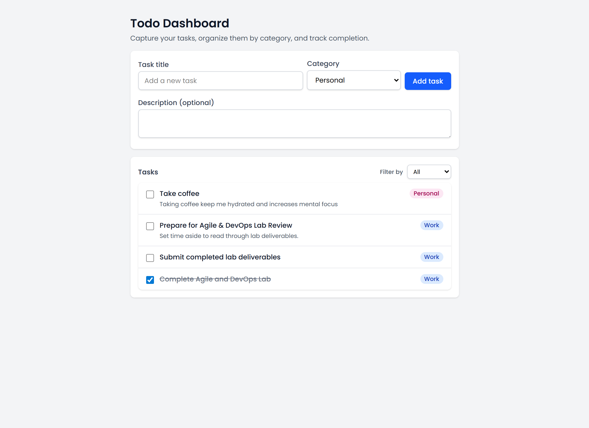

# Sprint 1 Review

## What Was Delivered

Sprint 1 successfully delivered three core user stories for the React Todo Dashboard:

1. **Add Tasks** (3 story points)
   - Users can add new tasks with a title and optional description
   - Form validation ensures tasks cannot be added without a title
   - Tasks appear immediately in the task list after creation

2. **Categorize Tasks** (3 story points)
   - Users can assign tasks to categories (Work, Personal, Urgent, Other)
   - Category badges are displayed with each task
   - Category filter allows users to view tasks by selected category

3. **Mark Tasks as Complete** (5 story points)
   - Users can toggle task completion status via checkbox
   - Completed tasks display with strikethrough styling
   - Tasks can be toggled back to incomplete state

## Features Status

All three features are **working as expected** and meet their acceptance criteria:

- ✅ Task creation with validation
- ✅ Category assignment and filtering
- ✅ Task completion toggling with visual feedback
- ✅ Responsive UI with Tailwind CSS styling
- ✅ Accessible components with proper ARIA labels

## Testing

**12 comprehensive unit tests** have been written and are all passing:

- **2 rendering tests**: App renders without crashing and core UI elements appear
- **3 add task tests**: Task creation, form clearing, and validation
- **3 category tests**: Category assignment, filtering by category, and "All" filter
- **2 complete task tests**: Toggle to completed and back to incomplete
- **2 form validation tests**: Empty title validation and correct payload submission

All tests use React Testing Library and follow best practices for testing user behavior rather than implementation details.

## CI/CD

GitHub Actions workflow has been configured and is running successfully:

- **Workflow**: `.github/workflows/main.yml`
- **Triggers**: Push to main branch and pull requests
- **Jobs**: Test and Build on Node.js 18
- **Steps**: Checkout, setup Node.js, install dependencies, run tests with coverage, build project
- **Status**: Pipeline configured and ready for continuous integration

The workflow ensures all tests pass and the project builds successfully before code is merged.

## Screenshots

## Summary

Sprint 1 delivered all planned features (11 story points) with comprehensive test coverage and CI/CD integration. The foundation is solid for Sprint 2 features (Delete Tasks, Save to Browser, Show Progress).
