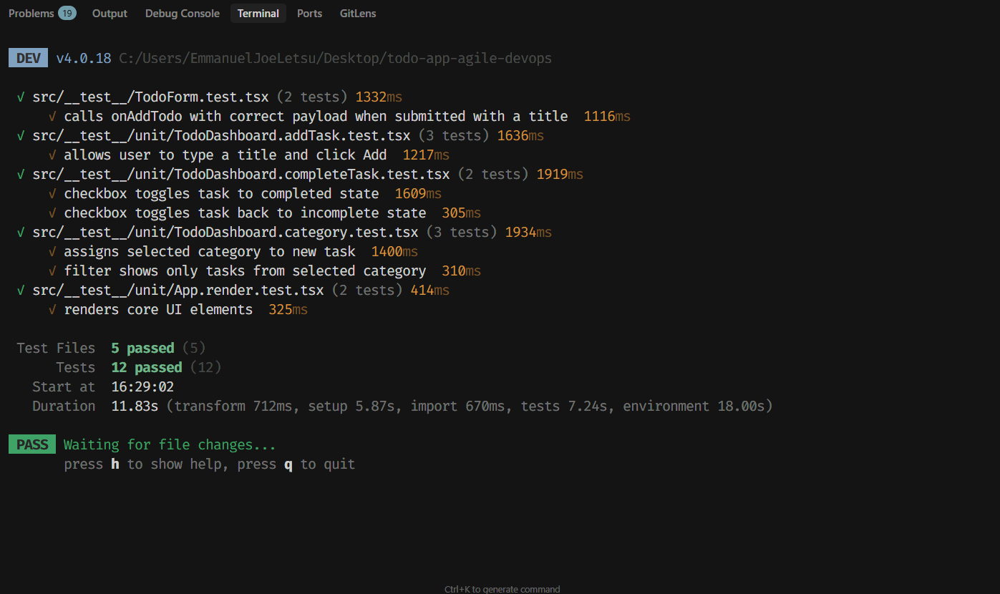
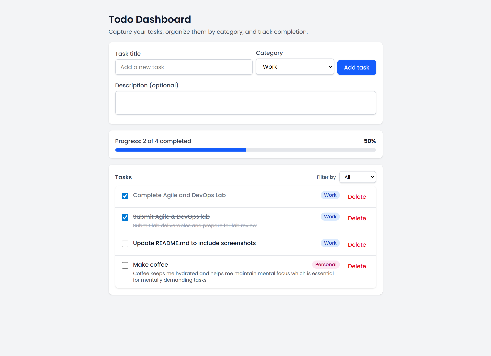
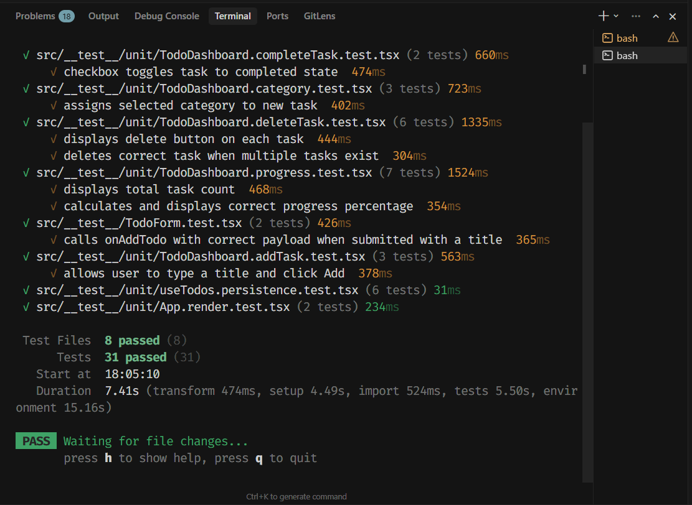

# Sprint 2 Review

## What Was Delivered

Sprint 2 successfully delivered three user stories for the React Todo Dashboard:

1. **Delete Tasks** (3 story points)
   - Delete button on each task item for easy removal
   - Confirmation dialog prevents accidental deletions
   - Tasks are immediately removed from the UI when deleted
   - Deleted tasks are removed from localStorage persistence

2. **Save Tasks to Browser** (5 story points)
   - Tasks automatically persist to `localStorage` on any change (add, complete, delete)
   - Tasks load from `localStorage` when the app mounts
   - All task properties are preserved: title, description, category, completion status, creation date
   - Graceful error handling for storage failures (quota exceeded, disabled storage, etc.)
   - Works seamlessly with all other features

3. **Show Progress** (3 story points)
   - Progress component displays total and completed task counts
   - Visual progress bar with percentage calculation
   - Real-time updates when tasks are added, completed, or deleted
   - Handles edge cases: empty list (0%), all completed (100%), no tasks

## Features Status

All three features are **working as expected** and meet their acceptance criteria:

- ✅ Task deletion with confirmation dialog
- ✅ Browser storage persistence (localStorage)
- ✅ Data loading on app mount
- ✅ Progress visualization with real-time updates
- ✅ Edge case handling (empty lists, storage errors)
- ✅ Integration with Sprint 1 features (add, categorize, complete)
- ✅ Responsive UI with Tailwind CSS styling
- ✅ Accessible components with proper ARIA labels

## Testing

**19 new comprehensive unit tests** were added in Sprint 2, bringing the total to **31 tests**, all passing:

### Sprint 2 Test Coverage:
- **6 delete task tests**: Delete button display, confirmation dialog, task removal, cancellation, multiple tasks
- **6 localStorage persistence tests**: Loading from storage, saving to storage, error handling, data integrity
- **7 progress tests**: Total count, completed count, percentage calculation, updates on changes, edge cases

### Complete Test Suite (31 tests total):
- **2 rendering tests**: App renders without crashing and core UI elements appear
- **3 add task tests**: Task creation, form clearing, and validation
- **3 category tests**: Category assignment, filtering by category, and "All" filter
- **2 complete task tests**: Toggle to completed and back to incomplete
- **2 form validation tests**: Empty title validation and correct payload submission
- **6 delete task tests**: All deletion scenarios and confirmation dialogs
- **6 persistence tests**: localStorage loading, saving, and error handling
- **7 progress tests**: Progress calculation and real-time updates

All tests use React Testing Library and Vitest, following best practices for testing user behavior rather than implementation details.

## CI/CD

GitHub Actions workflow continues to run successfully with Sprint 2 changes:

- **Workflow**: `.github/workflows/main.yml`
- **Triggers**: Push to main branch and pull requests
- **Jobs**: Test and Build on Node.js 20
- **Steps**: 
  1. Checkout repository
  2. Setup Node.js 20
  3. Install dependencies (`yarn install --frozen-lockfile`)
  4. Type check (`yarn type-check`)
  5. Run tests with coverage (`yarn test --run --coverage`)
  6. Build project (`yarn run build`)
- **Status**: Pipeline running successfully ✅

The workflow ensures all tests pass (31 tests), type checking succeeds, and the project builds successfully before code is merged. All Sprint 2 commits passed CI/CD validation.

## Integration with Sprint 1

All Sprint 2 features integrate seamlessly with Sprint 1 features:

- **Delete Tasks** works with categorized and completed tasks
- **localStorage persistence** saves and restores all task properties including categories and completion status
- **Progress calculation** accurately reflects tasks added, completed, and deleted
- **Category filtering** works correctly with persisted tasks
- **Task completion** state is preserved across page refreshes

## Screenshots

## Summary

Sprint 2 delivered all planned features (11 story points) with comprehensive test coverage (19 new tests), bringing the total to 31 passing tests. All features integrate seamlessly with Sprint 1 functionality, and the CI/CD pipeline continues to ensure code quality. The React Todo Dashboard now has complete CRUD functionality with persistence and progress tracking, meeting all acceptance criteria from the product backlog.
